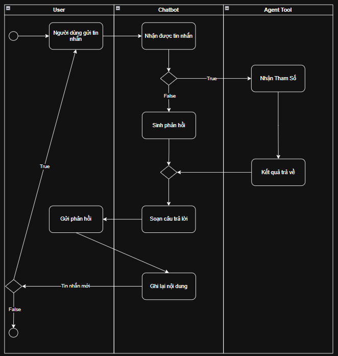
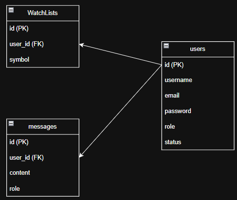

# Advisory Chatbot

> *An AI assistant for stock market analysis and stock-related conversations.*

## Overview

&nbsp;&nbsp;&nbsp;&nbsp;Advisory Chatbot is an AI assistant focused on stock market analysis. It leverages large language models, RAG, vector search, and stock data processing to provide accurate insights and answers based on user queries and market data.
## Architecture

### 1.Activity Diagram

&nbsp;&nbsp;&nbsp;&nbsp;Illustrates the chatbot activity flow, including message receiving, decision handling, response generation, and conversation storage.

<div align="center">
    
</div>

### 2.ER Diagram

&nbsp;&nbsp;&nbsp;&nbsp;Represents the database design and entity relationships for user management, chatbot messages, and stock watchlist tracking.

<div align="center">
    
</div>

## Folder Structure

```
advisory-chatbot/
├── README.md
└── backend/
    ├── bigquery/
    ├── chatbot/
    │   └── tools/
    ├── config/
    ├── core/
    ├── database/
    ├── docs/
    ├── dto/
    │   ├── request/
    │   │   ├── messages/
    │   │   ├── rag/
    │   │   ├── stock/
    │   │   ├── users/
    │   │   └── watchlists/
    │   └── response/
    ├── entity/
    ├── enums/
    ├── exception/
    ├── rag/
    │   ├── embedding/
    │   ├── ingestion/
    │   ├── retrieval/
    │   └── vectorstore/
    ├── repository/
    ├── routes/
    ├── service/
    └── util/
```